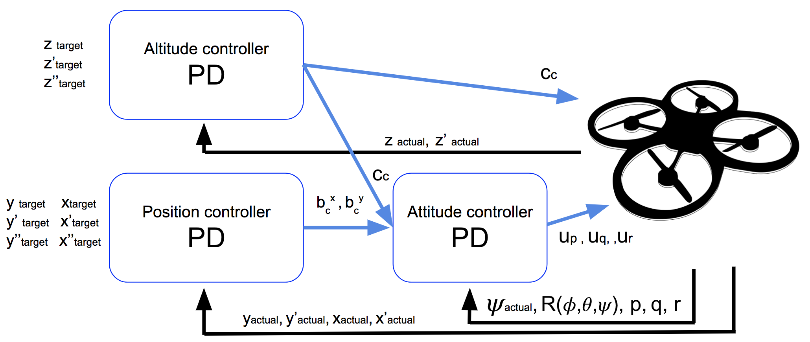
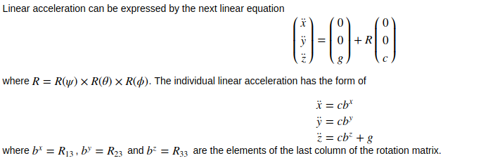

# FCND-Controls
3rd Project - Control of a 3D Quadrotor


## Ptyhon Part

 
---

In this part, the nested low-level controller needed to achieve trajectory following is explained. The controller is separated into five parts:

 - body rate control
 - reduced attitude control
 - altitude control
 - heading control
 - lateral position control
 
 The basic block diagram of quadrotor contoller is here
 
  [1]
 
The detailed block diagram of quadrotor controller is here. The theory behind the controller design is given in [this paper](http://www.dynsyslab.org/wp-content/papercite-data/pdf/schoellig-acc12.pdf) [2]
 
  [3]
 
 Each of the methods in `controller.py` is given below
 
 Reduced Attitude Control Diagram
 
   [3]

* **1- Body Rate Control ( body_rate_control() )**

The commanded roll, pitch, and yaw are collected by the body rate controller, and they are translated into the desired moment along the axis in the body frame. This control method use only P controller.

```py
    def body_rate_control(self, body_rate_cmd, body_rate):
        """ Generate the roll, pitch, yaw moment commands in the body frame
        
        Args:
            body_rate_cmd: 3-element numpy array (p_cmd,q_cmd,r_cmd) in radians/second^2
            body_rate: 3-element numpy array (p,q,r) in radians/second^2
            
        Returns: 3-element numpy array, desired roll moment, pitch moment, and yaw moment commands in Newtons*meters
        """

        rate_err = body_rate_cmd - body_rate

        Kp_rate = np.array([self.Kp_p, self.Kp_q, self.Kp_r])

        m_c = MOI * np.multiply(Kp_rate, rate_err) 

        m_c_value = np.linalg.norm(m_c)

        if m_c_value > MAX_TORQUE:
            m_c = m_c*MAX_TORQUE/m_c_value
        return m_c

```
* **2- Reduced Attitude Control ( roll_pitch_control() )**

The roll-pitch controller is a P controller responsible for commanding the roll and pitch rates ( p_c  and  q_c ) in the body frame. First, it sets the desired rate of change of the given matrix elements using a P controller.

   [3]
 
The rotation matrix elements  R13  (also referred to as  b_x ) and  R23  (also referred to as  b_y ). Lateral acceleration commend comes from lateral controller. By using it, b_x_target & b_y_target are obtained. 

   [3]
  
```py
    def roll_pitch_controller(self, acceleration_cmd, attitude, thrust_cmd):
        """ Generate the rollrate and pitchrate commands in the body frame
        
        Args:
            target_acceleration: 2-element numpy array (north_acceleration_cmd,east_acceleration_cmd) in m/s^2
            attitude: 3-element numpy array (roll, pitch, yaw) in radians
            thrust_cmd: vehicle thruts command in Newton
            
        Returns: 2-element numpy array, desired rollrate (p) and pitchrate (q) commands in radians/s
        """

        if thrust_cmd > 0 :

            c = -1 * thrust_cmd / DRONE_MASS_KG  

            # Find R13 (Target_X) and R23 (Target_Y)
            b_x_c_target , b_y_c_target  = np.clip(acceleration_cmd/c, -1, 1)  # min & max tilt (rad) 
             
            #Calculate Rotation Matrix
            rot_mat = euler2RM(attitude[0], attitude[1], attitude[2]) 

            b_x = rot_mat[0,2] # R13 (Actual)
            b_x_err = b_x_c_target - b_x
            b_x_p_term = self.Kp_roll * b_x_err

            b_y = rot_mat[1,2] # R23 (Actual)
            b_y_err = b_y_c_target - b_y
            b_y_p_term = self.Kp_pitch * b_y_err
            
            b_x_cmd_dot = b_x_p_term
            b_y_cmd_dot = b_y_p_term

            rot_mat1=np.array([[rot_mat[1,0],-rot_mat[0,0]],[rot_mat[1,1],-rot_mat[0,1]]])/rot_mat[2,2]
            rot_rate = np.matmul(rot_mat1,np.array([b_x_cmd_dot,b_y_cmd_dot]).T)
            
            p_c = rot_rate[0]
            q_c = rot_rate[1]

        else: 

            p_c = 0 
            q_c = 0
            thrust_cmd = 0

        return np.array([p_c, q_c])
```    
* **3- Altitude Control ( altitude_control() )** 

 [3]

A PD controller is used for the altitude control

```py
    def altitude_control(self, altitude_cmd, vertical_velocity_cmd, altitude, vertical_velocity, attitude,  acceleration_ff=0.0):
        """Generate vertical acceleration (thrust) command

        Args:
            altitude_cmd: desired vertical position (+up)
            vertical_velocity_cmd: desired vertical velocity (+up)
            altitude: vehicle vertical position (+up)
            vertical_velocity: vehicle vertical velocity (+up)
            attitude: the vehicle's current attitude, 3 element numpy array (roll, pitch, yaw) in radians
            acceleration_ff: feedforward acceleration command (+up)
            
        Returns: thrust command for the vehicle (+up)
        """
        
        alt_error = altitude_cmd - altitude

        p_term = self.Kp_alt * alt_error

        alt_dot_error = vertical_velocity_cmd - vertical_velocity

        d_term = self.Kd_alt * alt_dot_error

        acc_cmd = p_term + d_term + acceleration_ff

        b_z = np.cos(attitude[0]) * np.cos(attitude[1]) #  R33

        thrust = DRONE_MASS_KG * acc_cmd / b_z

        if thrust > MAX_THRUST:
            thrust = MAX_THRUST
        elif thrust < 0.0:
            thrust = 0.0
        return thrust

```  
* **4- Heading Control ( yaw_control() )**

A P controller is used to control the drone's yaw.

```py    
    def yaw_control(self, yaw_cmd, yaw):
        """ Generate the target yawrate
        
        Args:
            yaw_cmd: desired vehicle yaw in radians
            yaw: vehicle yaw in radians
        
        Returns: target yawrate in radians/sec
        """
        yaw_err = yaw_cmd - yaw

        if yaw_err > np.pi:
            yaw_err = yaw_err - 2.0*np.pi
        elif yaw_err < -np.pi:
            yaw_err = yaw_err + 2.0*np.pi
         
        r_c = self.Kp_yaw * yaw_err
        
        # within range of 0 to 2*pi
        r_c = np.clip(r_c, 0, 2*np.pi) 

        return r_c
```

* **5- Lateral Position Control ( lateral_position_control() )**

The drone generates lateral acceleration by changing the body orientation which results in non-zero thrust in the desired direction. A PD controller is used for the lateral controller. 

```py    
    def lateral_position_control(self, local_position_cmd, local_velocity_cmd, local_position, local_velocity,
                               acceleration_ff = np.array([0.0, 0.0])):
        """Generate horizontal acceleration commands for the vehicle in the local frame

        Args:
            local_position_cmd: desired 2D position in local frame [north, east]
            local_velocity_cmd: desired 2D velocity in local frame [north_velocity, east_velocity]
            local_position: vehicle position in the local frame [north, east]
            local_velocity: vehicle velocity in the local frame [north_velocity, east_velocity]
            acceleration_cmd: feedforward acceleration command
            
        Returns: desired vehicle 2D acceleration in the local frame [north, east]
        """

        lateral_pos_error = local_position_cmd - local_position

        p_term = self.Kp_lateral_pos * lateral_pos_error

        lateral_pos_dot_error = local_velocity_cmd - local_velocity

        d_term = self.Kd_lateral_pos * lateral_pos_dot_error

        acc_cmd = p_term + d_term + acceleration_ff


        return acc_cmd
```
**Evaluation**

* Maximum Horizantol Error < 2 m
* Maximum Vertical Error < 1 m
* Mission Time < 20 s


**Video**
[](https://www.youtube.com/watch?v=FtIspS_226Y&feature=youtu.be)


## CPP Part ##


**References**
* [1] https://github.com/udacity/FCND-Controls
* [2] A. P. Schoellig, C. Wiltsche and R. D’Andrea, 2012, "Feed-Forward Parameter Identification for Precise Periodic
   Quadrocopter Motions", American Control Confrence, Fairmont Queen Elizabeth, Montreal, Canada, 27-29 June 2012 
* [3] FCND Lesson 4 - 3D Drone-Full-Notebook ( [3D Controller Part](https://classroom.udacity.com/nanodegrees/nd787/parts/5aa0a956-4418-4a41-846f-cb7ea63349b3/modules/b78ec22c-5afe-444b-8719-b390bd2b2988/lessons/2263120a-a3c4-4b5a-9a96-ac3e1dbae179/concepts/47b0380b-3d5a-426b-8409-45f947c8f343#) ) 
