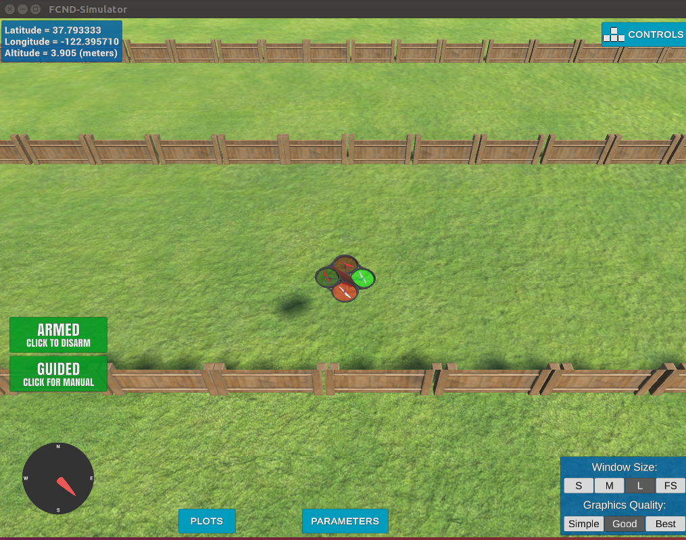

# FCND-Controls
3rd Project - Control of a 3D Quadrotor


## Ptyhon Part


---

In this part, the nested low-level controller needed to achieve trajectory following is explained. The controller is separated into five parts:

 - body rate control
 - reduced attitude control
 - altitude control
 - heading control
 - lateral position control
 
 The block diagram of this contoller is here
 
 

* **1- Read Global Home , Global Position and Local Position**
```
print('global home {0}, position {1}, local position {2}'.format(self.global_home, self.global_position,
                                                                         self.local_position))
```
* **2- Read "Collider.csv" file and obtaining obstacle in the map**
```
data = np.loadtxt('colliders.csv', delimiter=',', dtype='Float64', skiprows=2)
```    
* **3- Creat Grid with a particular altitude and safety margin around obstacles via Planning_utils.py** 
```
grid, north_offset, east_offset = create_grid(data, TARGET_ALTITUDE, SAFETY_DISTANCE)

```  
      * a-Find North_min , North_max , East_min and East_max
      * b-Find Nort and East Size 
      * c-Creat a zero grid array by using Nort and East Size  
      * d-Find obstacles and insert into the grid array
      * e-Return Grid , north_offset , east_offset

Configuration Space 


* **4- Define Start and Goal Point**
```    
 grid_start = (-north_offset, -east_offset)
       
 grid_goal = (-north_offset + 10, -east_offset + 10)
```
